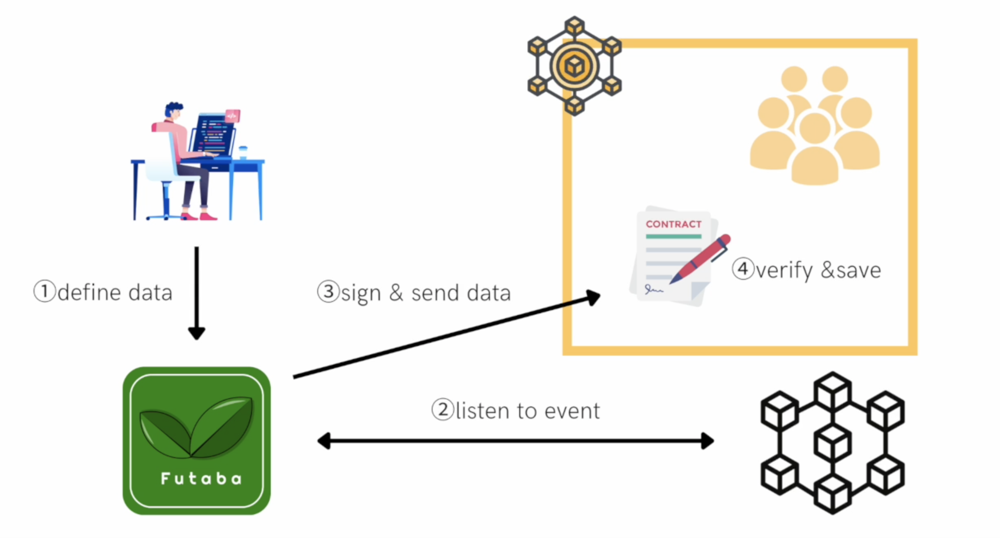

# ETHOnline 2022 -- Futaba

This is the official ETHOnline 2022 submission for our project Futaba 🍃.

## Project Description

We propose **Futaba**, a protocol dedicated to retrieving data from other chains on smart contracts.
The developer flexibly defines the data he/she wants to acquire from other chains, and based on this, Futaba will request data from the target contract when data changes occur for the target contract. After acquiring the data, Futaba will send the data to the contract of the specific chain.
In other words, like The Graph, you can freely define the data you want to acquire, and the data is sent to a specific contract, like Oracle's data feed.

## Features

Off-chain data, but not on-chain data from other chains can be retrieved on a regular basis
It also allows for more flexible data acquisition, as developers can freely configure what kind of data they want to acquire and which events are triggered.
It also supports multiple chains.

- Polygon
- Optimism
- Cronos
- Aurora
- Oasis

In this hackathon, we are getting data about APY from Optimism's AAVE contract and sending the data to Polygon testnet's contract.

- SM dataBase deployed on Polygon : https://mumbai.polygonscan.com/address/0xd737408b3ce7c6559496ea0cade16a951945356b
- Aave contract : https://optimistic.etherscan.io/address/0x794a61358d6845594f94dc1db02a252b5b4814ad#code

## How it Works



1. Register the data that the developer wants to feed in the database.
2. Futaba's node triggers the event and retrieves the data from a specific chain or a specific contract.
3. The data is signed and stored in the database contract.
4. The developer can access the data retrieved from the database contract

## What's next for Futaba ?

We are planning to add many features such as :

- Development of Futaba use cases : a cross-chain yield aggregator for more efficient operation of DeFi.
- Improved security of data acquisition : further security and decentralization using TSS + MPC

## Getting Started

```bash
# Install dependencies
yarn install
# execute test
yarn hardhat test
```

## Twitter :

- Account : https://twitter.com/FutabaDex

## Contact Information :

Preferred contact information : You can contact the team on the address : kato_goki@andlaw.co.jp

## More Detail :

For more information about the project, please refer to [this](https://first-twine-2d1.notion.site/Lite-Paper-ae6f767832c6449d8fda1c74d0af9acf)
